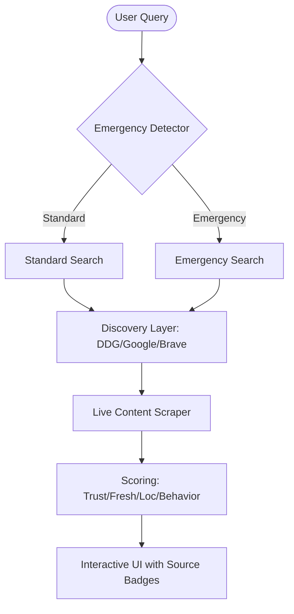

# 🚨 DivyaDhrishti: Emergency-Aware Search Engine

**DivyaDhrishti** is a next-generation search engine designed for the high-stakes environment of natural disasters and public emergencies. It goes beyond keyword matching to understand context, verifying information through AI, and ensuring accessibility even when primary search services are throttled or blocked.

---


1.  **Run the Application**:
    ```bash
    ./run_dev.sh
    ```
    *The server will start on [http://localhost:5001](http://localhost:5001)*

2.  **Toggle "AI Enhanced"**:
    Enable the AI toggle to trigger the **Naive Bayes Classifier** for superior emergency detection.

---

## 🛠 Features 

### 1. Resilient 8-Tier Search Architecture
DivyaDhrishti is built with a powerhouse **8-tier failover system** to ensure the user never goes "blind" during a blackout or network throttling:
- **tier 1 local URL's  indexing**
- **Tier 2 (Google Search)**: Secondary commercial backup.
- **Tier 3 (Brave Search)**: Direct scraping for high resilience.
- **Tier 4 (Bing Search)**: Microsoft-backed fallback.
- **Tier 5 (Yahoo Search)**: Diversified web index support.
safety net.

### 2. Intelligent Emergency Detection (Hybrid AI)
Uses a dual-detection system:
- **Heuristic Engine**: Instant keyword matching for **60+ disaster types**.
- **NB Classifier**: A massive probability model trained on:
    - **Natural Disasters**: Wildfires, Floods, Earthquakes, Avalanches.
    - **Medical Crises**: CPR, Stroke, Overdose, Emergency Birth.
    - **Public Safety**: Kidnapping, Human Trafficking, Active Shooter.
    - **Industrial/Social**: Toxic Spills, Radiation, Domestic Violence.

### 3. Truth & Freshness Scoring
Every result is dynamically scored based on:
- **Trust Tiers**: Official gov/edu/mil domains get instant boosts.
- **Freshness**: In Emergency Mode, the engine forces a 1-week time filter to prioritize live updates.
- **Location Relevance**: Integrated NER (Named Entity Recognition) detects location in queries to boost local rescue/shelter information.

### 4. Direct Content Scraping
Instead of just showing "snippets," DivyaDhrishti can crawl the actual content of discovered pages to provide deeper analysis and verification.

---

## 🏗 Architecture Overview



## 📜 Prerequisites

- **Python 3.8+**
- **pip**
- (Optional) `spacy` for advanced location detection (`python -m spacy download en_core_web_sm`)

---

*Developed for the Collegiate Hackathon Series 2026.*
